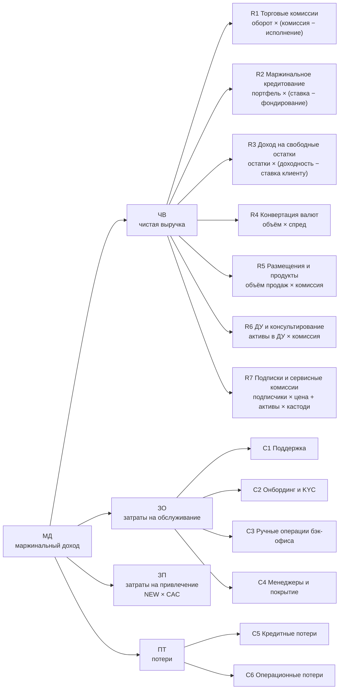
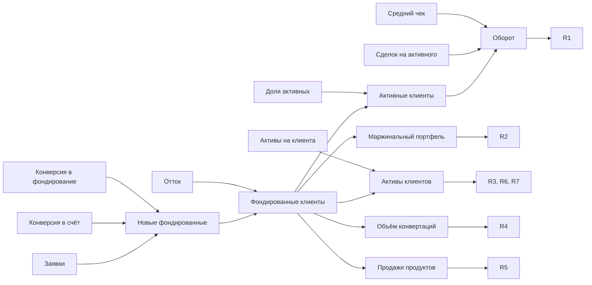

# Этап 1. Система метрик брокерского бизнеса

Статус: черновик v0.1 от 07.10.2026. Модель — [broker_roadmap_model.xlsx](broker_roadmap_model.xlsx), бенчмарки — [отчёт](../reports/Бенчмарки%20метрик%20публичных%20брокеров.md).

## Коротко

- Верх дерева — **маржинальный доход (МД)** = чистая выручка − затраты на обслуживание − затраты на привлечение − потери. Постоянные расходы (ИТ-платформа, центральные функции) в МД не входят.
- Под МД — 7 источников дохода и 7 статей затрат и потерь. Каждый источник раскладывается на «объём × ставку», объём — на клиентскую базу и поведение клиентов. В модели 41 драйвер на сегмент (из них 2 внешних и 8 ценовых), на них будут ссылаться гипотезы.
- Над драйверами — 34 опережающих индикатора: их гипотезы двигают напрямую (конверсия KYC, активация, доля STP и т. п.). Рядом — 9 ограничителей, которые не должны ухудшаться, и 8 внешних факторов, на которые гипотезы не претендуют.
- Любой драйвер переводится в деньги. Лист «Чувствительность» показывает, сколько МД даёт улучшение драйвера на 1% или на практический шаг (1 п.п., 1 б.п.), в двух горизонтах: «год 1» и «долгосрочно».
- Что видно уже сейчас, на иллюстративных данных, откалиброванных по публичным брокерам:
  - **в долгую главные рычаги — удержание и воронка.** Снижение оттока на 1 п.п. во всех сегментах даёт ≈ +13,9 млн у.е. МД в год (13% долгосрочного МД), +1 п.п. конверсии «заявка → счёт» — ≈ +2,2 млн. В горизонте «год 1» те же драйверы привлечения дают минус, потому что CAC платится сразу;
  - **45% чистой выручки зависит от ставок** (в масс-рознице 54%). Снижение доходности размещения остатков на 1 п.п. отнимает ≈ 12,3 млн у.е. МД в год;
  - **прямая экономия от автоматизации мала:** −1 п.п. ручных операций даёт ≈ +0,13 млн у.е. Эффект автоматизации через конверсию и отток — на один-два порядка больше.

## 1. Решения, принятые на старте

| Вопрос | Решение | Следствие для модели |
|---|---|---|
| Рынок | Универсальная модель без привязки к юрисдикции | Ориентиры — публичные брокеры; регуляторика вынесена во внешние факторы |
| Сегменты | Масс-розница (МР), состоятельные (СК), институционалы и корпоративные (ИК) | Все вводные — в трёх колонках; B2B-ветки нет |
| Верх дерева | Маржинальный доход вместо выручки | Автоматизация и снижение затрат оцениваются в деньгах наравне с ростом выручки |
| Регуляторные задачи | Отдельный обязательный трек | Не конкурируют с гипотезами за приоритет; получают квоту ёмкости |
| Формат | Excel-модель + markdown в репозитории | Модель — источник правды для данных, документы — для логики |

## 2. Принципы построения

1. **Арифметика, а не ассоциации.** Каждый узел дерева — формула от дочерних. Поэтому изменение любого драйвера переводится в деньги, а гипотезы сравниваются в одной валюте.
2. **Управляемое отдельно от рыночного.** Ставки, волатильность, курс и календарь размещений — внешние факторы. Гипотеза претендует только на управляемый драйвер, а результат нормируется на рынок (доля рынка `X_SHARE`).
3. **Два горизонта оценки.** «Год 1» — эффект на P&L плана: новые клиенты приносят доход полгода, а CAC оплачивается сразу. «Долгосрочно» — к чему сходится бизнес при новом значении драйвера: база стремится к NEW ÷ CHURN.
4. **Ограничители.** Гипотеза принимается, только если не ухудшает риск, качество и комплаенс: кредитный риск маржи, доступность торговой системы, жалобы, соответствие продаж профилю клиента.
5. **Паспорт на каждую метрику.** Определение, формула, единица, источник данных, частота, владелец, риски интерпретации — лист «Паспорта».

## 3. Дерево метрик

Финансовая часть: от МД до источников дохода и статей затрат.

Клиентская часть: общий драйвер для всех веток.

Полное дерево с текущими значениями — лист «Дерево» модели, определения — лист «Паспорта».

## 4. Источники дохода

| Код | Источник | Формула | Управляемые драйверы | Внешние факторы |
|---|---|---|---|---|
| R1 | Торговые комиссии (нетто) | Оборот × (комиссия − затраты на исполнение) | Доля активных, сделок на клиента, средний чек, тарифы | Волатильность |
| R2 | Маржинальное кредитование (нетто) | Портфель × (ставка клиенту − фондирование) | Проникновение маржи, средняя задолженность, ставка | Ставка фондирования |
| R3 | Доход на свободные остатки (нетто) | Остатки × (доходность размещения − ставка клиенту) | Активы на клиента, доля кэша, ставка клиенту | Ставки рынка, правила размещения |
| R4 | Конвертация валют | Объём конвертаций × спред | Доля конвертирующих, объём на клиента, спред | Курс, валютное регулирование |
| R5 | Размещения и продукты | Объём продаж × комиссия или маржа | Проникновение продуктов, объём покупок | Календарь размещений |
| R6 | ДУ и консультирование | Активы в ДУ × комиссия | Доля активов в ДУ, комиссия | — |
| R7 | Подписки и сервисные комиссии | Подписчики × цена + активы × кастодиальная ставка | Проникновение подписки, цена, тарифы | — |

Каждый источник считается за вычетом прямых затрат, неотделимых от операции: биржевых и клиринговых сборов, фондирования, процентов клиентам. Так сравнение с конкурентами идёт в нетто-выражении, а валовые комиссии не завышают долю торговли.

## 5. Затраты и потери

| Код | Статья | Формула | Что двигает |
|---|---|---|---|
| C1 | Поддержка | Клиенты × обращений на клиента × стоимость обращения | Самообслуживание, качество продукта |
| C2 | Онбординг и KYC | Заявки × (авто-проверка + доля ручной × стоимость ручной) | Автоматизация KYC |
| C3 | Ручные операции бэк-офиса | Клиенты × операций на клиента × доля ручных × стоимость | STP, автоматизация |
| C4 | Менеджеры и покрытие | Клиенты ÷ нагрузка × стоимость менеджера | Нагрузка на менеджера, цифровые инструменты |
| ЗП | Привлечение | Новые фондированные × CAC | Каналы, реферальные программы |
| C5 | Кредитные потери | Маржинальный портфель × уровень потерь | Риск-политика маржи |
| C6 | Операционные потери | Инциденты, компенсации, штрафы | Стабильность систем, контроль |

## 6. Опережающие индикаторы, ограничители, внешние факторы

- **Опережающие индикаторы (L4)** — то, что гипотезы двигают напрямую и что видно через недели, а не через квартал. Группы: привлечение, онбординг, активация, вовлечённость, удержание, монетизация, обслуживание, операции. Каждый привязан к драйверу модели, например `L4_FUND30` (доля счетов, пополненных за 30 дней) → `CR_FUND`.
- **Ограничители (G)** — доступность торговой системы, качество исполнения, инциденты, кредитный риск маржи, запас по пруденциальным нормативам, жалобы, соответствие продаж профилю, ПОД/ФТ, реакция на изменение тарифов.
- **Внешние факторы (X)** — ставки, волатильность, индекс, курс, календарь размещений, регуляторные изменения, тарифы конкурентов, доля рынка (нормирующая метрика).

## 7. Чувствительность: «курс обмена» драйверов на деньги

Модель линейна по каждому драйверу (кроме нагрузки на менеджера и долгосрочного эффекта оттока). Поэтому эффект гипотезы «+5% к драйверу X в сегменте S» равен 5 × значение из таблицы. На этапе 2 это позволит оценивать гипотезы без отдельной модели на каждую.

Значения ниже рассчитаны на **иллюстративных** вводных и показывают механику, а не приоритеты.

Базовый МД: **86,9 млн у.е.** в горизонте «год 1» и **105,7 млн у.е.** в долгосрочном. Чистая выручка — 114,5 млн у.е.

**Ценность улучшения драйвера на 1%, все три сегмента, у.е. МД в год.** Объёмные и затратные драйверы, без ценовых и внешних:

| Ранг | Драйвер | Код | Долгосрочно | Год 1 |
|---|---|---|---:|---:|
| 1 | Годовой отток фондированных клиентов (−1%) | `CHURN` | 1,17 млн | 44 тыс. |
| 2–3 | Конверсии «заявка → счёт» и «счёт → фондированный» | `CR_OPEN`, `CR_FUND` | 1,08 млн | −28 тыс. |
| 4 | Заявки на открытие счёта | `LEADS` | 1,06 млн | −43 тыс. |
| 5 | Средние активы на клиента | `AUC_PC` | 0,50 млн | 0,42 млн |
| 6 | Доля свободных денег в активах | `CASH` | 0,34 млн | 0,28 млн |
| 7–9 | Доля активных, сделок на активного, средний чек | `ACT`, `TPA`, `TICKET` | 0,26 млн | 0,22 млн |
| 10–11 | Проникновение маржи и средняя задолженность | `MRG_PEN`, `MRG_DEBT` | 0,25 млн | 0,21 млн |

**Ценность практического шага, все три сегмента, у.е. МД в год:**

| Драйвер | Шаг | Год 1 | Долгосрочно |
|---|---|---:|---:|
| Отток `CHURN` | −1 п.п. | +0,48 млн | ≈ +13,9 млн (оценка снизу) |
| Конверсия в счёт `CR_OPEN` | +1 п.п. | −55 тыс. | +2,24 млн |
| Конверсия в фондирование `CR_FUND` | +1 п.п. | −52 тыс. | +1,62 млн |
| Доля активных `ACT` | +1 п.п. | +0,64 млн | +0,77 млн |
| Проникновение маржи `MRG_PEN` | +1 п.п. | +2,74 млн | +3,33 млн |
| Проникновение продуктов `PRD_PEN` | +1 п.п. | +2,31 млн | +2,61 млн |
| Проникновение подписки `SUB_PEN` | +1 п.п. | +0,46 млн | +0,56 млн |
| Ручные операции `OPS_MAN` | −1 п.п. | +0,13 млн | +0,16 млн |
| Ручная проверка KYC `KYC_MAN` | −1 п.п. | +27 тыс. | +27 тыс. |
| Комиссия брокера `TAKE` (ценовой рычаг) | +1 б.п. | +6,53 млн | +7,46 млн |
| Доходность размещения `FLOAT_Y` (внешний фактор) | ±1 п.п. | ±12,3 млн | ±14,6 млн |

Шаг в 1 п.п. весит по-разному: для масс-розницы с проникновением маржи 5% это +20% маржинальных клиентов, для институционалов с 20% — лишь +5%. Насколько реален сдвиг, решается на этапе 2 по каждой гипотезе.

### Что видно уже на иллюстративных данных

1. **Горизонт переворачивает рейтинг.** В долгую четыре верхних драйвера — удержание и воронка, каждый вдвое ценнее следующего. В горизонте «год 1» привлечение уходит в минус, а снижение оттока весит в 26 раз меньше. Масс-розница окупает привлечение дольше всех — за 12 месяцев против 10 у состоятельных и 2,5 у институционалов. Поэтому оценка «на год вперёд» сильнее всего обесценивает её рост.
2. **Ставки весят больше любой гипотезы.** На проценты (маржа и остатки) приходится 45% чистой выручки, в масс-рознице — 54%. У публичных брокеров эта доля 40–58%. Рынок может за год «съесть» эффект всей дорожной карты, поэтому план нужно строить по сценариям ставок, а гипотезы оценивать только по управляемой части.
3. **Активность — три равноценных рычага.** +1% к доле активных, к частоте сделок или к среднему чеку дают одинаковые +0,22 млн у.е. в год 1: все три умножают один и тот же оборот. Выбор между ними — вопрос стоимости и реалистичности, а не ценности.
4. **Автоматизацию нельзя оценивать только экономией.** −1 п.п. ручной проверки KYC экономит 27 тыс. у.е., а +1 п.п. конверсии в счёт, который даёт та же автоматизация за счёт скорости, — 2,24 млн в долгую. Разница — более чем в 80 раз.
5. **Ценовые рычаги выглядят лучше, чем есть.** +1% к ставкам по марже (в масс-рознице 12% → 12,12%) даёт +0,79 млн у.е. в год, но без учёта реакции клиентов. Ценовые решения нужно вести отдельным типом гипотез, с тестом на когорте и ограничителем `G_PRICE`.

## 8. Ориентиры по рынку

Цифры получены из поисковых выдержек первоисточников: прямой доступ к отчётам компаний был закрыт сетевыми ограничениями среды. Для внутренней калибровки этого достаточно, перед внешним использованием цифры нужно сверить с документами. Полный отчёт с источниками — [reports/Бенчмарки метрик публичных брокеров.md](../reports/Бенчмарки%20метрик%20публичных%20брокеров.md).

| Метрика | Ориентиры | В модели (МР / СК / ИК) |
|---|---|---|
| Доходность активов клиентов, б.п. в год | Robinhood 154–173; flatexDEGIRO 66–67; Nordnet 48–55; Avanza 43–47; Swissquote 79–88; частные банки 82–91 (UBS ≈59); IBKR 85–92; Schwab ≈22, Advisor Services ≈10 | 112 / 112 / 35 |
| Выручка на клиента в год | Robinhood $171–187; eToro $221–264; flatexDEGIRO €170–184; Avanza SEK 2,1–2,3 тыс.; Freedom ≈ $206 брокерских комиссий и ≈ $360 процентов по марже | 90 / 2 245 / 87 120 у.е. |
| Доля процентного дохода в выручке | IBKR 56–58%; Schwab 49%; Freedom 40%; Swissquote 30% | 54% / 38% / 39% |
| Маржинальный портфель к активам | Robinhood 5,6%; IBKR 10,9–11,7%; Schwab 1–1,3% | 5% / 7,5% / 4% |
| Свободные остатки к активам | Robinhood 8,1%; Schwab 8,8–9,7%; IBKR 19–21% | 12% / 8% / 5% |
| Удержание клиентов в год | Webull и Futu ≈88–92%; Hargreaves Lansdown 91–92%; AJ Bell 94%; Wealthfront 95% | 88% / 94% / 92% |
| CAC | Robinhood $15–53 (2019–2021), до $222 (2025); Wealthfront $85–131; Futu ≈ $295; Tiger $150–400; eToro до $575 | 80 / 1 500 / 15 000 у.е. |
| Маркетинг к выручке | Robinhood 8,9%; Trading 212 UK 18,6%; eToro 20% | 13% / 5% / 1,5% |
| Чистый приток, % активов в год | Robinhood 27–35%; Swissquote 11–12%; flatexDEGIRO ≈11%; Nordnet ≈9%; Avanza 5–7%; Schwab 4,4–5,8%; частные банки 2–6% | Не моделируется отдельно — входит в `AUC_PC` |
| Активность и пустые счета | Мосбиржа 2025: в среднем месяце торгуют 8,7% счетов, за год — 25%; 63% счетов пустые, у 86% клиентов ≤ 10 тыс. ₽ (ЦБ РФ) | Доля активных среди фондированных: 25% / 45% / 70% |
| Затраты к доходам | Nordnet 27%; Avanza 31%; Robinhood 53%; частные банки 63–76%; маржа до налога IBKR 77% | МД ÷ ЧВ: 74% / 72% / 83% (до постоянных расходов) |

Чего в открытых источниках нет: пошаговых конверсий онбординга, раскрытого оттока по когортам, доли клиентов с маржой, нагрузки на поддержку, кастодиальных ставок и комиссий андеррайтинга. Эти вводные в модели условные.

## 9. Челлендж постановки

1. **«Влияние на доходы» → маржинальный доход** — принято. Оговорка: экономия от автоматизации засчитывается, только если высвобожденные ресурсы сокращены или поглощают рост без найма. Иначе это экономия «на бумаге». В шаблоне гипотез механизм будет обязательным полем.
2. **Горизонт оценки решает исход** (наблюдение 1). Если дорожную карту оценивать по P&L следующего года, она систематически недофинансирует рост базы и переоценит цену и монетизацию. Предложение: приоритизировать по долгосрочному эффекту, а бюджет и обязательства на год проверять по году 1. В карте гипотез показывать оба значения.
3. **Ставочная зависимость** (наблюдение 2). Гипотезы, снижающие долю процентного дохода (подписки, ДУ, сервисные комиссии), стоит поощрять отдельно — это вопрос весов на этапе 4.
4. **Автоматизация недооценена, если считать её экономией** (наблюдение 4). Для каждой ИТ-доработки нужно указывать, на какие драйверы выручки она влияет: скорость онбординга → конверсия, качество сервиса → отток.
5. **Определения «клиента».** Без порога фондированности и чёткого критерия активности база раздувается пустыми счетами. В России таких 63%. Тогда ARPU и отток несопоставимы ни между периодами, ни с конкурентами.
6. **Сегменты в модели независимы,** хотя переход из масс-розницы в состоятельные — вероятно, самый ценный переход: ARPU растёт с 90 до 2 245 у.е. Сейчас он виден только как приток заявок в СК, и отдельную гипотезу об апгрейде модель не оценит.
7. **«Выделение сервисов в продукты» при B2B вне периметра** требует расшифровки (вопрос 3 ниже): от неё зависит, хватит ли текущего дерева или нужна новая ветка.
8. **Данные.** Модели нужно 42 вводных на сегмент. Пошаговую воронку, отток по когортам и стоимость ручной операции многие брокеры не собирают. Если так и у вас, первым проектом карты становится сквозная аналитика, иначе гипотезы нечем мерить.

## 10. Открытые вопросы

Блокирующие для этапа 2:

1. **Горизонт для решений по проектам:** год 1, run-rate на конец года или долгосрочно? Моё предложение — приоритет по долгосрочному эффекту, бюджет по году 1.
2. **Пороги:** с какой суммы активов клиент считается фондированным? Что считать активностью — только сделку или любую операцию, включая пополнение и покупку продукта?
3. **«Выделение сервисов в продукты».** Что имеется в виду:
   - (а) новые платные продукты для своих сегментов: подписка на аналитику, автоследование, робо-эдвайзер — ложатся в ветки R5–R7;
   - (б) внутренний сервис с собственным владельцем и P&L, например онбординг и KYC как платформа для всей группы — ценность через затраты и конверсию;
   - (в) всё-таки внешние клиенты — тогда добавлю ветку B2B.
4. **Данные:** есть ли фактические значения вводных и кто их владелец? Если по части драйверов данных нет — согласны включить сквозную аналитику в карту как фундаментный проект?

Можно ответить позже:

5. Моделировать ли переход клиентов из масс-розницы в состоятельные явно?
6. Какой сценарий ставок брать на горизонт плана: базовый, снижение или рост?
7. Для этапов 3–4: горизонт дорожной карты, ёмкость команд и единицы оценки трудозатрат.

## 11. Следующий шаг — этап 2

Шаблон карты гипотез: одна строка — одна гипотеза. Поля: формулировка «если … то … потому что …», тип (доработка ИТ / не ИТ / выделение сервиса в продукт / ценовое решение / обязательное), сегменты, целевой драйвер, ожидаемый сдвиг (пессимистичный / базовый / оптимистичный), уверенность и её основание, способ проверки (A/B, пилот, когорта), критерий остановки, ограничители под риском. Денежный эффект считается автоматически через лист «Чувствительность» в обоих горизонтах.
